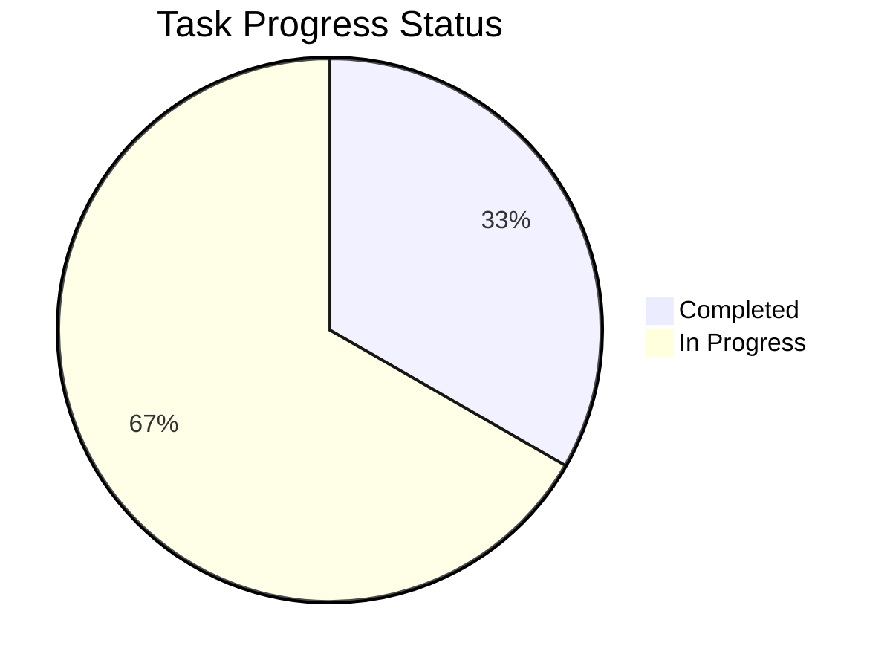

# Task Management & Proposal System Guide

[English](README.en.md) | [한국어](README.md)

## 📌 Overview

This integrated system provides comprehensive task management and proposal processing for GitHub projects. It combines automated task tracking with proposal-to-task conversion workflow, enabling systematic project management through GitHub Issues and Project boards.

## 🔧 Key Features

### 1. **Proposal Processing System**
   - Convert proposal issues into actionable tasks
   - Automatic task creation from approved proposals
   - Proposal-task linking and relationship tracking
   - Assignee transfer and proper labeling

### 2. **Task Management**
   - CSV-format task proposal processing
   - Standardized issue template generation
   - Schedule visualization through Gantt charts
   - Label-based approval workflow

### 3. **Project Tracking**
   - Real-time progress monitoring
   - Category-based task organization
   - Automatic statistics and reporting
   - GitHub Project board integration

## 💫 Proposal Issue Template

Proposal issues should follow this template:

```markdown
## 📋 Proposal Information
- Proposer: @username
- Target Date: YYYY-MM-DD
- Category: feature|bug|enhancement

## 🎯 Objective
Brief description of what needs to be done

## 📝 Requirements
- [ ] Requirement 1
- [ ] Requirement 2
- [ ] Requirement 3

## 📊 Acceptance Criteria
- [ ] Criteria 1
- [ ] Criteria 2
```

## 📋 CSV Task Proposal Format

Alternatively, task proposals can be written in CSV format:

```csv
[Task Name],UI/UX Enhancement Project
Proposer,John Smith
Proposal Date,2024-02-15
Target Date,2024-03-01

[Task Purpose]
Improve user experience and apply modern design to enhance system usability and aesthetics.

[Task Scope]
1. Dashboard UI renewal
2. Responsive design implementation
3. Dark mode support
4. Accessibility improvements

[Required Features]
- Modern design system application
- Mobile-responsive layout
- User feedback integration
- Cross-browser compatibility

[Optional Features]
- Animation effects
- Custom theme support
- Real-time preview

[Schedule]
Design Draft Creation,2024-02-15,3d
Feedback Collection,2024-02-18,2d
UI Implementation,2024-02-20,5d
Testing,2024-02-25,3d
Deployment,2024-02-28,2d
```

### Task Categories

The system provides the following default categories:

- 🔧 Development: Core functionality implementation and development tasks
- 🎨 UI/UX: User interface and experience related tasks
- 🔍 QA/Testing: Quality assurance and testing related tasks
- 📚 Documentation: Documentation writing and management tasks
- 🛠️ Maintenance: Bug fixes and performance improvement tasks

### Proposal Workflow

1. **Create Proposal**: Create issue with "proposal" label
2. **Review**: Team reviews the proposal
3. **Approve**: Add "approved" label when ready
4. **Convert**: Automation converts to task issue
5. **Track**: Task follows normal issue lifecycle

### Approval Labels

- ⌛ proposal: Mark issues as proposals
- ✅ approved: Mark proposals ready for conversion
- ❌ rejected: Task rejected and needs revision
- 🏷️ task: Applied to converted task issues
- ⏸️ on-hold: Needs further discussion

## 📋 Auto-generated Report Format

````markdown
# 📊 Project Progress Report

## 📌 Basic Information

**Project Name**: Project Name
**Report Date**: YYYY-MM-DD
**Report Period**: YYYY-MM-DD ~ Ongoing

## 📋 Task Details

<details>
<summary><h3>🔧 Development (1/3)</h3></summary>

| Task ID | Task Name              | Assignee | Est. Time | Act. Time | Status         | Priority |
| ------- | ---------------------- | -------- | --------- | --------- | -------------- | -------- |
| TSK-1   | Feature Implementation | @user    | 5d        | -         | 🟡 In Progress | -        |

</details>

## 📊 Progress Summary

Progress: 1/3 completed (33.3%)


````

## 📝 Special Notes and Risks

| Type | Content                  | Mitigation Plan               |
| ---- | ------------------------ | ----------------------------- |
| Risk | Potential schedule delay | Consider additional resources |

````

## ⚙️ Configuration

Workflow settings can be modified in `.github/workflows/task_management.yml`:

```yaml
name: Task Management Automation

on:
  push:
    paths:
      - "TaskProposals/*.csv"
  issue_comment:
    types: [created]
  issues:
    types: [labeled, unlabeled]

permissions:
  issues: write
  contents: read
````

## 🔗 Related Systems

### GitHub Automation System Integration
This TaskManagement system can be used together with the [GitHub Automation System](../GitHubAutomation/):

- **TaskManagement**: CSV-based task proposal processing and project planning
- **GitHubAutomation**: Commit-based DSR generation and real-time project board synchronization

Using both systems together enables complete project lifecycle management:
1. Plan and approve tasks with TaskManagement
2. Track execution progress and automation with GitHubAutomation

## ⚠️ Important Notes

1. CSV files must follow the exact format.
2. Task proposals must be placed in the `TaskProposals` directory.
3. Only use specified labels for the approval process.
4. Do not manually modify reports as they are automatically updated.
5. All time durations must be specified in 'd' (days) units.

---

<div align="center">

### 🔗 Related Links

[Main Settings Repository](../../) • 
[GitHub Automation System](../GitHubAutomation/) •
[Baekjoon Logging](../BaekjoonLogging/)

**📋 Achieve successful project completion with systematic task management!**

</div>
