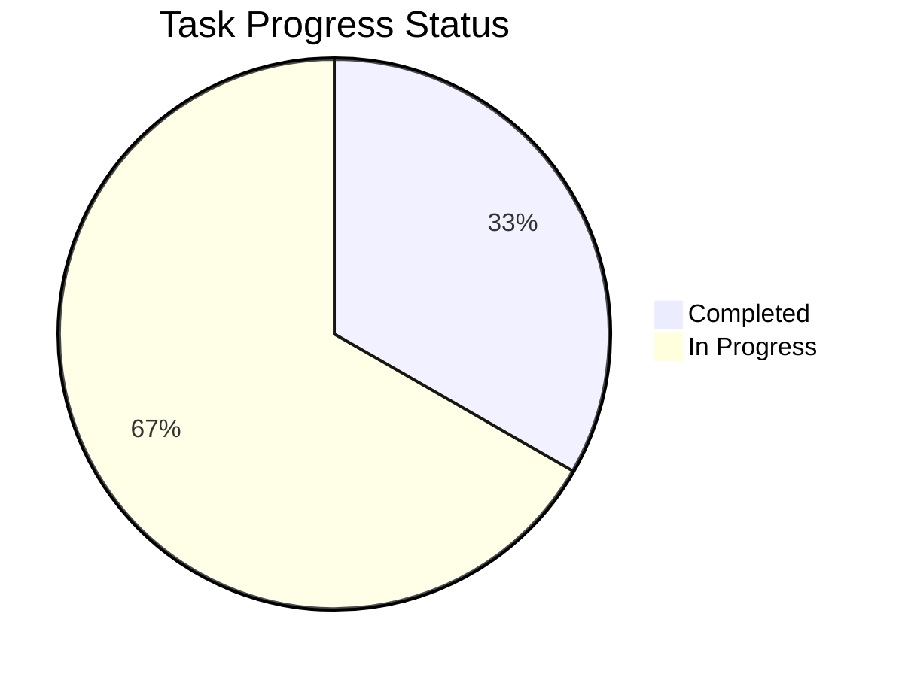

# Task Management Action Guide

[English](README.en.md) | [한국어](README.md)

## 📌 Overview

This GitHub Action is an automated system for systematically creating, managing, and tracking project tasks. It generates issues based on CSV-format task proposals and automatically updates project reports through an approval process.

## 🔧 Key Features

1. **Task Proposal and Creation**

   - Automatic processing of CSV-format task proposals
   - Standardized issue template generation
   - Schedule visualization through Gantt charts

2. **Approval Process Management**

   - Label-based approval system
   - Automatic category classification
   - Automated handling based on approval status

3. **Project Reports**
   - Real-time progress tracking
   - Category-based task management
   - Automatic statistics generation and visualization

## 💫 Task Proposal Format

Task proposals should be written in CSV format following this structure:

```csv
[Task Name],UI/UX Enhancement Project
Proposer,John Smith
Proposal Date,2024-02-15
Target Date,2024-03-01

[Task Purpose]
Improve user experience and apply modern design to enhance system usability and aesthetics.

[Task Scope]
1. Dashboard UI renewal
2. Responsive design implementation
3. Dark mode support
4. Accessibility improvements

[Required Features]
- Modern design system application
- Mobile-responsive layout
- User feedback integration
- Cross-browser compatibility

[Optional Features]
- Animation effects
- Custom theme support
- Real-time preview

[Schedule]
Design Draft Creation,2024-02-15,3d
Feedback Collection,2024-02-18,2d
UI Implementation,2024-02-20,5d
Testing,2024-02-25,3d
Deployment,2024-02-28,2d
```

### Task Categories

The system provides the following default categories:

- 🔧 Development: Core functionality implementation and development tasks
- 🎨 UI/UX: User interface and experience related tasks
- 🔍 QA/Testing: Quality assurance and testing related tasks
- 📚 Documentation: Documentation writing and management tasks
- 🛠️ Maintenance: Bug fixes and performance improvement tasks

### Approval Process

Tasks are managed through the following approval labels:

- ⌛ Pending Review: Initial review pending status
- ✅ Approved: Task approved and ready to start
- ❌ Rejected: Task rejected and needs revision
- ⏸️ On Hold: Needs further discussion

## 📋 Auto-generated Report Format

````markdown
# 📊 Project Progress Report

## 📌 Basic Information

**Project Name**: Project Name
**Report Date**: YYYY-MM-DD
**Report Period**: YYYY-MM-DD ~ Ongoing

## 📋 Task Details

<details>
<summary><h3>🔧 Development (1/3)</h3></summary>

| Task ID | Task Name              | Assignee | Est. Time | Act. Time | Status         | Priority |
| ------- | ---------------------- | -------- | --------- | --------- | -------------- | -------- |
| TSK-1   | Feature Implementation | @user    | 5d        | -         | 🟡 In Progress | -        |

</details>

## 📊 Progress Summary

Progress: 1/3 completed (33.3%)


````

## 📝 Special Notes and Risks

| Type | Content                  | Mitigation Plan               |
| ---- | ------------------------ | ----------------------------- |
| Risk | Potential schedule delay | Consider additional resources |

````

## ⚙️ Configuration

Workflow settings can be modified in `.github/workflows/task_management.yml`:

```yaml
name: Task Management Automation

on:
  push:
    paths:
      - "TaskProposals/*.csv"
  issue_comment:
    types: [created]
  issues:
    types: [labeled, unlabeled]

permissions:
  issues: write
  contents: read
````

## ⚠️ Important Notes

1. CSV files must follow the exact format.
2. Task proposals must be placed in the `TaskProposals` directory.
3. Only use specified labels for the approval process.
4. Do not manually modify reports as they are automatically updated.
5. All time durations must be specified in 'd' (days) units.
