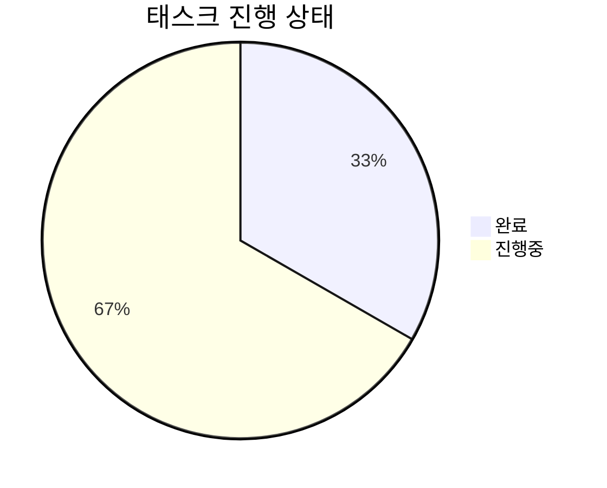

# Task Management 액션 사용 설명서

[English](README.en.md) | [한국어](README.md)

## 📌 개요

이 GitHub 액션은 프로젝트 태스크를 체계적으로 생성, 관리하고 진행 상황을 추적하는 자동화 시스템입니다. CSV 형식의 태스크 제안서를 기반으로 이슈를 생성하고, 승인 프로세스를 통해 프로젝트 보고서를 자동으로 업데이트합니다.

## 🔧 주요 기능

1. **태스크 제안 및 생성**

   - CSV 형식의 태스크 제안서 자동 처리
   - 표준화된 이슈 템플릿 생성
   - 간트 차트를 통한 일정 시각화

2. **승인 프로세스 관리**

   - 라벨 기반의 승인 시스템
   - 자동 카테고리 분류
   - 승인 상태에 따른 자동 처리

3. **프로젝트 보고서**
   - 실시간 진행 상황 추적
   - 카테고리별 태스크 관리
   - 자동 통계 생성 및 시각화

## 💫 태스크 제안서 작성 방법

태스크 제안서는 CSV 형식으로 작성하며, 다음 구조를 따릅니다:

```csv
[태스크명],UI/UX 개선 프로젝트
제안자,김고고
제안일,2024-02-15
구현목표일,2024-03-01

[태스크목적]
사용자 경험을 개선하고 현대적인 디자인을 적용하여 시스템의 사용성과 심미성을 향상시킵니다.

[태스크범위]
1. 대시보드 UI 리뉴얼
2. 반응형 디자인 구현
3. 다크모드 지원
4. 접근성 개선

[필수요구사항]
- 모던한 디자인 시스템 적용
- 모바일 대응 레이아웃
- 사용자 피드백 반영
- 크로스 브라우저 호환성

[선택요구사항]
- 애니메이션 효과 추가
- 커스텀 테마 지원
- 실시간 미리보기

[일정계획]
디자인 시안 작성,2024-02-15,3d
피드백 수렴,2024-02-18,2d
UI 구현,2024-02-20,5d
테스트,2024-02-25,3d
배포,2024-02-28,2d
```

### 태스크 카테고리

시스템은 다음과 같은 기본 카테고리를 제공합니다:

- 🔧 기능 개발: 핵심 기능 구현 및 개발 관련 태스크
- 🎨 UI/UX: 사용자 인터페이스 및 경험 관련 태스크
- 🔍 QA/테스트: 품질 보증 및 테스트 관련 태스크
- 📚 문서화: 문서 작성 및 관리 관련 태스크
- 🛠️ 유지보수: 버그 수정 및 성능 개선 관련 태스크

### 승인 프로세스

태스크는 다음 라벨을 통해 승인 상태가 관리됩니다:

- ⌛ 검토대기: 초기 검토 대기 상태
- ✅ 승인완료: 태스크 승인 및 진행 시작
- ❌ 반려: 태스크 반려 및 수정 필요
- ⏸️ 보류: 추가 논의 필요

## 📋 자동 생성되는 보고서 형식

````markdown
# 📊 프로젝트 진행 보고서

## 📌 기본 정보

**프로젝트명**: Project Name
**보고서 작성일**: YYYY-MM-DD
**보고 기간**: YYYY-MM-DD ~ 진행중

## 📋 태스크 상세 내역

<details>
<summary><h3>🔧 기능 개발 (1/3)</h3></summary>

| 태스크 ID | 태스크명  | 담당자 | 예상 시간 | 실제 시간 | 진행 상태 | 우선순위 |
| --------- | --------- | ------ | --------- | --------- | --------- | -------- |
| TSK-1     | 기능 구현 | @user  | 5d        | -         | 🟡 진행중 | -        |

</details>

## 📊 진행 현황 요약

진행 상태: 1/3 완료 (33.3%)


````

## 📝 특이사항 및 리스크

| 구분 | 내용             | 대응 방안             |
| ---- | ---------------- | --------------------- |
| 위험 | 일정 지연 가능성 | 추가 리소스 투입 검토 |

````

## ⚙️ 환경 설정

워크플로우 설정은 `.github/workflows/task_management.yml`에서 수정할 수 있습니다:

```yaml
name: Task Management Automation

on:
  push:
    paths:
      - "TaskProposals/*.csv"
  issue_comment:
    types: [created]
  issues:
    types: [labeled, unlabeled]

permissions:
  issues: write
  contents: read
````

## ⚠️ 주의사항

1. CSV 파일은 정확한 형식을 따라야 합니다.
2. 태스크 제안서는 `TaskProposals` 디렉토리에 위치해야 합니다.
3. 승인 프로세스는 지정된 라벨만 사용해야 합니다.
4. 보고서는 자동으로 업데이트되므로 수동으로 수정하지 마세요.
5. 모든 시간은 'd' (일) 단위로 지정해야 합니다.
