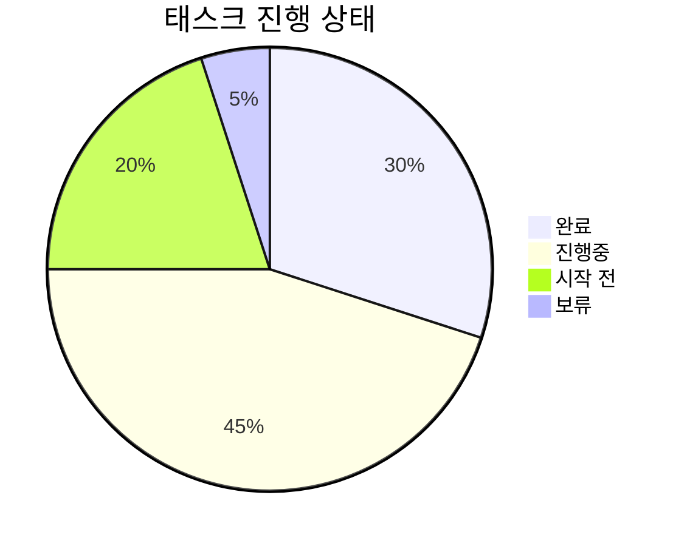

# 📊 태스크 진행 보고서

## 📌 기본 정보

**보고서 작성일**: YYYY-MM-DD  
**프로젝트명**: [프로젝트명]  
**작성자**: [작성자명]  
**보고 기간**: YYYY-MM-DD ~ YYYY-MM-DD

## 📋 태스크 상세 내역

<h3>🔧 기능 개발</h3>

| 태스크 ID | 태스크명               | 담당자 | 예상 시간 | 실제 시간 | 진행 상태 | 우선순위 |
| --------- | ---------------------- | ------ | --------- | --------- | --------- | -------- |
| DEV-001   | 예시: 로그인 기능 구현 | 홍길동 | 16h       | -         | 🟡 진행중 | HIGH     |

**진행 상태 범례**:

- 🔴 시작 전
- 🟡 진행중
- 🟢 완료
- ⚫ 보류

<h3>🎨 UI/UX</h3>

| 태스크 ID | 태스크명               | 담당자   | 예상 시간 | 실제 시간 | 진행 상태  | 우선순위 |
| --------- | ---------------------- | -------- | --------- | --------- | ---------- | -------- |
| UI-001    | 예시: 메인 화면 디자인 | 김디자인 | 8h        | -         | 🔴 시작 전 | MEDIUM   |

<h3>🔍 QA/테스트</h3>

| 태스크 ID | 태스크명               | 담당자   | 예상 시간 | 실제 시간 | 진행 상태  | 우선순위 |
| --------- | ---------------------- | -------- | --------- | --------- | ---------- | -------- |
| QA-001    | 예시: 유닛 테스트 작성 | 이테스터 | 4h        | -         | 🔴 시작 전 | LOW      |

## ⏱️ 시간 산정 기준

### 복잡도 기준

- **낮음 (4h 이하)**

  - 단순 UI 수정
  - 문서 작성
  - 간단한 버그 수정

- **중간 (8h-16h)**

  - 새로운 기능 구현
  - 중간 규모 리팩토링
  - 테스트 케이스 작성

- **높음 (24h-40h)**
  - 핵심 시스템 구현
  - 대규모 리팩토링
  - 성능 최적화

### 우선순위 기준

- **HIGH**: 프로젝트 진행에 필수적인 태스크
- **MEDIUM**: 중요하지만 즉시 필요하지 않은 태스크
- **LOW**: 추가적인 개선사항이나 옵션 기능

## 📊 진행 현황 요약

### 전체 진행률

### 카테고리별 소요 시간

| 카테고리  | 예상 시간 | 실제 시간 | 차이 |
| --------- | --------- | --------- | ---- |
| 기능 개발 | 80h       | 75h       | -5h  |
| UI/UX     | 40h       | 45h       | +5h  |
| QA/테스트 | 20h       | 18h       | -2h  |

## 📝 특이사항 및 리스크

| 구분   | 내용                     | 대응 방안               |
| ------ | ------------------------ | ----------------------- |
| 리스크 | 예시: API 응답 속도 저하 | 캐싱 도입 검토          |
| 이슈   | 예시: 테스트 환경 불안정 | 테스트 서버 리소스 증설 |

## 📈 다음 주 계획

1. [주요 태스크 1]

   - 세부 계획
   - 예상 소요 시간

2. [주요 태스크 2]
   - 세부 계획
   - 예상 소요 시간
