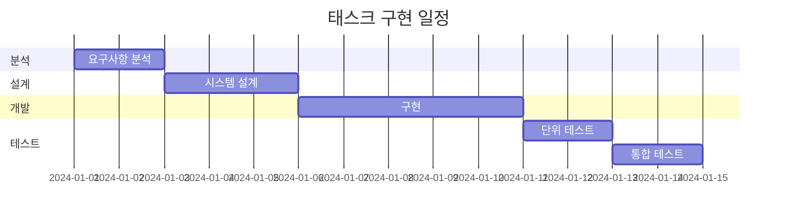

# 프로젝트 태스크 제안서

## 1. 제안 개요

**프로젝트명**: [프로젝트명]  
**제안자**: [제안자명]  
**제안일**: YYYY-MM-DD  
**구현 목표일**: YYYY-MM-DD

## 2. 태스크 요약

### 2.1 목적

[태스크의 주요 목적과 기대효과를 간단히 서술]

### 2.2 범위

[태스크의 구현 범위와 제한사항 서술]

## 3. 상세 내용

#### 메인 요구사항

- 요구사항 1
- 요구사항 2
- 요구사항 3

#### 선택 요구사항

- 선택사항 1
- 선택사항 2

## 4. 일정 계획

